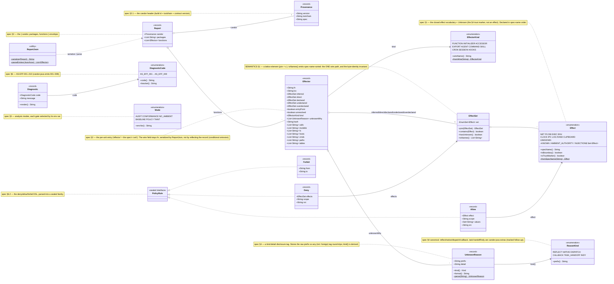

# candor-java domain model — annotated UML

The `io.poly.candor.model` package: the spec's nouns as types (candor-spec [SPEC.md](https://github.com/tombaldwin/candor-spec/blob/main/SPEC.md) /
[SEMANTICS.md](https://github.com/tombaldwin/candor-spec/blob/main/SEMANTICS.md) / [MODEL.md](https://github.com/tombaldwin/candor-spec/blob/main/MODEL.md)).
Produced by `ReportWriter` (analyzer) and consumed by `Query` — the same types on both sides, via one
`ReportJson` (de)serializer.

> Rendered: [model-uml.svg](model-uml.svg) (open raw for a crisp, zoomable view). Mermaid source below.

## Reading the diagram

- **The report spine** `Report → Effector → EffectSet → Effect` is the data an analysis produces and a
  query consumes. `Report` (the §2 envelope) holds a `Provenance` header and the `Effector`s; each
  `Effector` carries five `EffectSet`s (the conformance axes), its `EffectorKind`, and its
  `UnknownReason` disclosure list.
- **`EffectSet.toNames()` is the single serialization path** and always emits spec-name-sorted. Because
  every effect→wire path goes through it, the internal representation (an `EnumSet<Effect>`) is free to
  differ from the wire without changing a byte — this is what made full internal adoption safe.
- **`PolicyRule` is a sealed family** (`Deny`/`Allow`/`Forbid`) — the parsed §6.2 DSL, exhaustively
  switchable. `Diagnostic`/`DiagnosticCode` type the §6 AS-EFF findings; `Mode` types the §3 gate modes.
- **`ReportJson` is the one (de)serializer** — `ReportWriter` builds a `Report` and serializes it;
  `Query` parses reports back into `Effector`s. Wire field names (`fn`, `unitKind`, `packages`) are
  historical and unchanged.

The cross-engine realization of these same concepts is in candor-spec/MODEL.md — a shared *vocabulary*,
each engine deriving it independently from the spec (not shared code).
